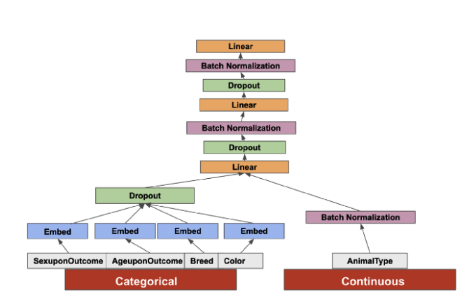

## Welcome to MaDNes 1.0 (Mixture Density Network for Bayesian Probabilistic Regression) documentation.

#### Base model architecture for this branch:



### Branches

For the development of different ideas we make use of different branches.

- `master` -> base functional model at the actual state of development.

#### CI/CD

We use GitHub actions to generate CI pipelines. Actually we have the following pipelines:

```
- pushing master branch changes to all branches automatically
```

## Data Preparation

For the data cleaning part it is important to have:

- values >= 0 (not negative, as sometimes id_model can be)
- no NaNs
- no Infs
- dtypes corresponding to the ones in the TF
- should we limit Price range

```python
df.columns = df.columns.str.lower()
df = df.replace([np.inf, -np.inf], np.nan)
df = df.dropna()
df = df.drop_duplicates([config.INDEX_COL_NAME])
df = df.loc[df["id_model"] >= 0,: ]
df = df.loc[df["price"] > 15,: ]
df = df.astype(config.NP_DTYPES).astype({"price": np.int32})
```
